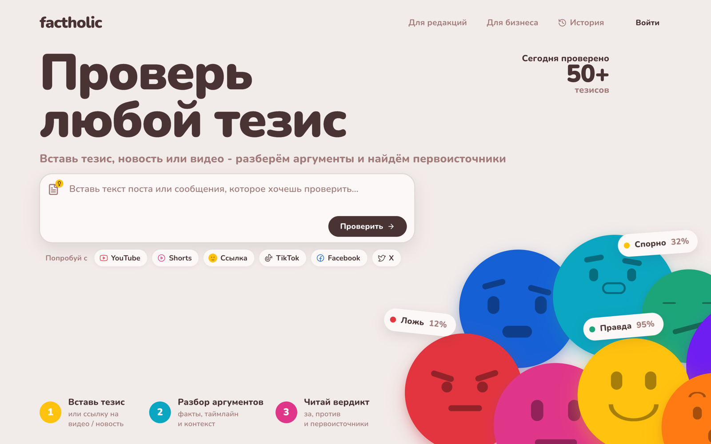
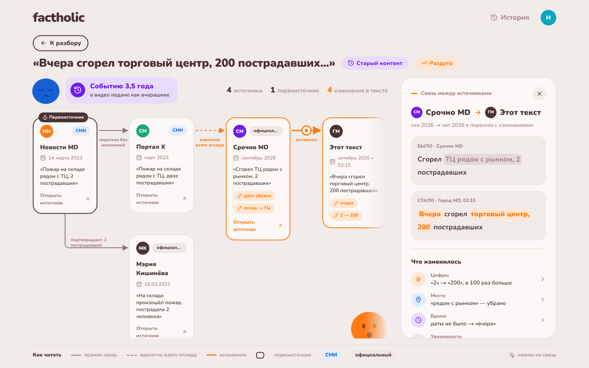
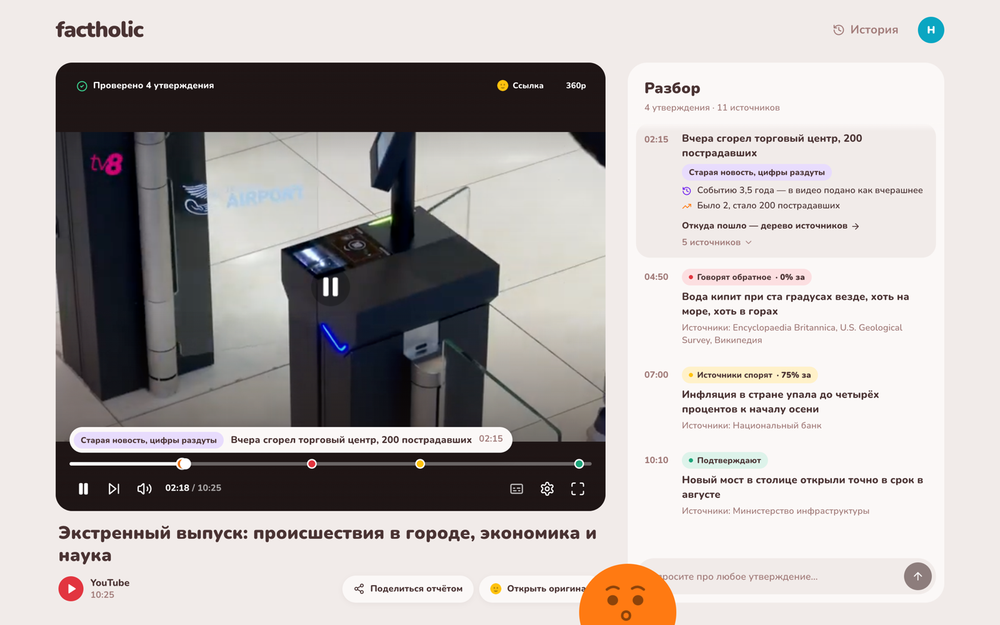
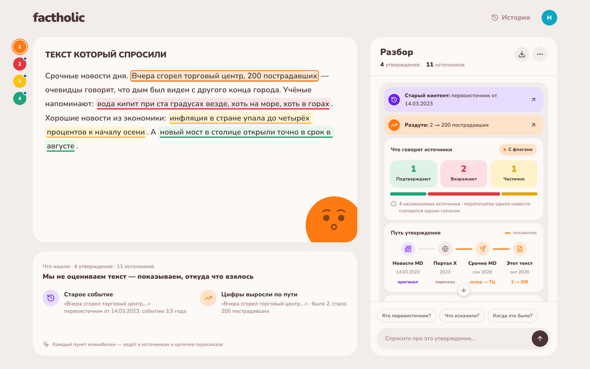
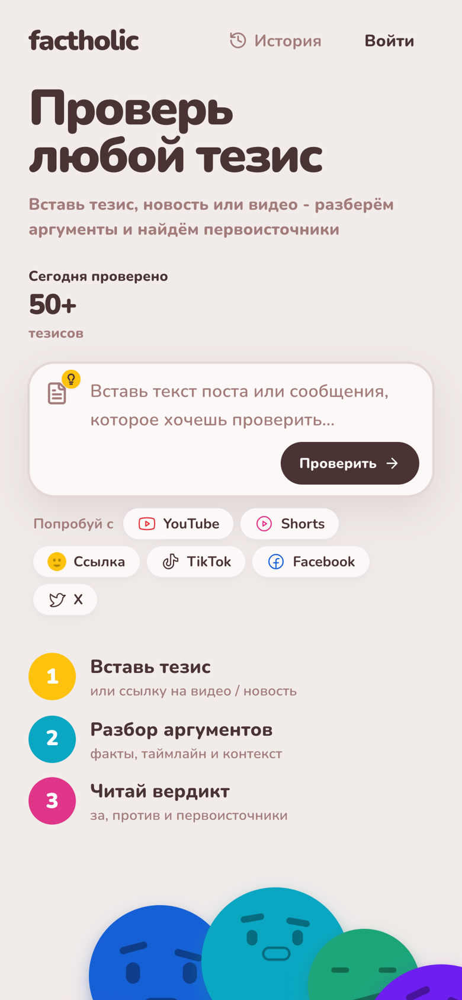
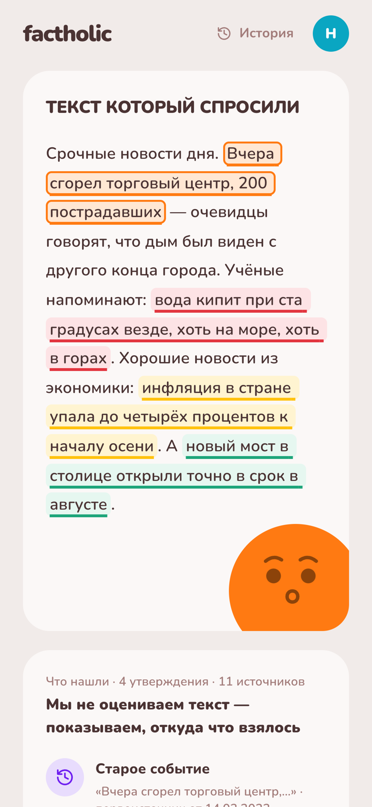
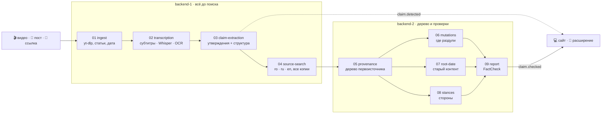

<div align="center">


# factholic

### Не «правда или ложь», а **откуда взялось утверждение**

Вставь видео, пост или ссылку — factholic найдёт все публикации об утверждении, покажет первоисточник,
кто у кого взял, где по дороге раздули цифры и не выдают ли старую новость за свежую.




</div>

---

## ✨ Что умеет

<table>
<tr>
<td width="50%" valign="top">

### 🌳 Дерево первоисточника

Кто у кого взял: от самой ранней публикации до проверяемого материала. Связь по явной ссылке — сплошная линия,
по совпадению текста — пунктир «вероятно взято отсюда». На каждом шаге видно, **что изменилось**: цифры, место,
время, уверенность.

</td>
<td width="50%" valign="top">

### 🎬 Видео по таймкодам

Свой плеер поверх YouTube: утверждения отмечены точками на полосе, справа — лента разбора, которая идёт вместе
с видео. Открыл дерево — плеер сворачивается в мини-окно и играет дальше.

</td>
</tr>
<tr>
<td></td>
<td></td>
</tr>
<tr>
<td width="50%" valign="top">

### 📝 Текст, посты и статьи

Вставь текст или ссылку на новость — утверждения подсветятся прямо в тексте цветом сторон, а справа —
флаги, путь утверждения и источники со ссылками.

</td>
<td width="50%" valign="top">

### ⚖️ Стороны, а не вердикт

Сколько **независимых** источников подтверждают, возражают или согласны частично. Пять перепечаток одной
новости — один голос. Мало источников — так и пишем, а не угадываем.

</td>
</tr>
<tr>
<td colspan="2"></td>
</tr>
</table>

### 📱 И на телефоне

<p align="center">
  
  &nbsp;&nbsp;
  
</p>

<sub>На скриншотах — демо-данные из `packages/contracts/src/mocks`.</sub>

---

## 🧭 Принципы

|     |                                           |                                                                                                   |
| :-: | ----------------------------------------- | ------------------------------------------------------------------------------------------------- |
| 🔗  | **Только по найденным публикациям**       | Дерево, изменения и стороны строятся по реальным источникам со ссылками, а не «из головы» модели. |
| 🤔  | **Связь без доказательства — «вероятно»** | Ребро по явной ссылке — подтверждено, по совпадению текста — помечено как вероятное.              |
| 🗳️  | **Честный подсчёт**                       | Перепечатки одной новости — один голос. Источники разных типов, стран и языков.                   |
| 🤝  | **Нейтральный тон**                       | Без оценочных эпитетов и политической позиции.                                                    |
| 🎯  | **Факты, а не мнения**                    | Мнения, шутки и вопросы не проверяем. Прогнозы показываем, но сторон у них нет.                   |
| 🔍  | **Прозрачность**                          | Всегда видны дословная цитата, первая публикация, ссылки на все узлы и что изменилось по дороге.  |

> **Пример.** В видео от 2 октября: «вчера Кишинёв завалило снегом, полметра за ночь». Корень — новость января
> 2021 года про 10 см; по дороге 10 см → 30 см → полметра. Флаги: **«Старый контент»** и **«Раздули»**.

---

## ⚙️ Как это работает



- Утверждения находятся сразу и показываются серыми, а дорогая проверка (поиск + LLM) идёт **по требованию**:
  текущее утверждение в плеере и следующие за ним, открытые пользователем. Шортсы и тексты проверяются целиком.
- Протокол: `POST /api/jobs` → `{ jobId, eventsUrl }` → WebSocket со стримом событий (`packages/contracts/src/api.ts`).
- Каждый этап — функция `Stage<In, Out>` со своим `mock.ts` и `real.ts`: любой этап включается в mock или real
  отдельно, поэтому пайплайн работает end-to-end с первого дня.

---

## 🚀 Быстрый старт

```bash
npm install            # зависимости + git-хук pre-commit
cp .env.example .env   # режимы mock/real по этапам и ключи API

npm run dev:mock       # бэкенд проигрывает демо-события — для фронта без ключей
npm run dev            # бэкенд с настоящим пайплайном на :8787
npm run dev:web        # сайт на :3000
npm run build:ext      # расширение → extension/dist → chrome://extensions → «Загрузить распакованное»
```

Для настоящего пайплайна нужны [`yt-dlp`](https://github.com/yt-dlp/yt-dlp) и `ffmpeg`
(`brew install yt-dlp ffmpeg`) и ключи провайдеров в `.env`. Без ключей всё работает на моках.

| Что            | Переменная                               | Значения                |
| -------------- | ---------------------------------------- | ----------------------- |
| режим сервера  | `SERVER_MODE`                            | `pipeline` / `replay`   |
| все этапы      | `STAGES_DEFAULT`                         | `mock` / `real`         |
| отдельный этап | `STAGE_INGEST`, `STAGE_SOURCE_SEARCH`, … | `mock` / `real`         |
| сайт → бэкенд  | `WEB_DATA_SOURCE`, `WEB_BACKEND_URL`     | `mock` / `backend`, URL |

---

## 🧱 Стек

|                |                                                                               |
| -------------- | ----------------------------------------------------------------------------- |
| **Сайт**       | Next.js 14 · React 18 · Tailwind CSS · Radix UI · AI SDK · YouTube IFrame API |
| **Бэкенд**     | Node 22 · TypeScript · WebSocket · yt-dlp · ffmpeg                            |
| **ИИ**         | OpenAI — утверждения, позиции источников, изменения, Whisper, эмбеддинги      |
| **Поиск**      | Tavily · Google Fact Check                                                    |
| **Расширение** | Chrome MV3 · `tabCapture` + offscreen document для live-режима                |

```
packages/contracts/   общие типы бэк ↔ фронт + моки для дизайна
backend/src/stages/   по папке на этап: README · types.ts · mock.ts · real.ts · index.ts
backend/src/pipeline/ оркестратор, очередь проверок, хранилище задач
web/                  сайт: главная, разбор, дерево, плеер
extension/            расширение Chrome
scripts/              проверки по юнитам (npm run check)
```

---

## 👥 Для команды

<details>
<summary><b>Роли и владельцы папок</b></summary>

<br/>

Команда: 2 бэкенд-разработчика + 1 фронтенд. У каждого этапа один владелец.

| Роль                                       | Папки                                                                                                                    |
| ------------------------------------------ | ------------------------------------------------------------------------------------------------------------------------ |
| **backend-1** — всё до поиска включительно | `stages/01-ingest`, `02-transcription`, `03-claim-extraction`, `04-source-search`, `pipeline/`, `server.ts`, `config.ts` |
| **backend-2** — дерево и проверки          | `stages/05-provenance`, `06-mutations`, `07-root-date`, `08-stances`, `09-report`                                        |
| **frontend** — сайт и расширение           | `web/`, `extension/`                                                                                                     |
| общее, только по договорённости            | `packages/contracts/`, корневые конфиги, `scripts/`                                                                      |

- Граница **backend-1 ↔ backend-2** — `03-claim-extraction/types.ts` и `04-source-search/types.ts`: меняете вдвоём.
- Граница **бэкенд ↔ фронт** — `packages/contracts/`: меняется только втроём.
- Подробно про этапы, контракты и mock/real — в [AGENTS.md](AGENTS.md).

</details>

<details>
<summary><b>Коммиты делают люди, а не AI-агенты</b></summary>

<br/>

Агенты (Claude Code, Codex, Cursor…) не коммитят и не пушат — только **предлагают** готовые команды
`git add …` + `git commit -m "…"`, а вы выполняете их из обычного терминала или IDE.
Для Claude Code это включено через `.claude/settings.json` и `.husky/pre-commit`; подробно — в
[AGENTS.md](AGENTS.md#git-коммитит-только-человек).

</details>

<details>
<summary><b>Pre-commit: проверки по юнитам, а не по всему репо</b></summary>

<br/>

При `git commit` хук проверяет **только то, что ты коммитишь**:

1. `eslint --fix` + `prettier` — по застейдженным файлам.
2. `tsc` — по **юнитам**, которых касаются эти файлы (реестр — `scripts/units.mjs`).

Сломанный незакоммиченный код в чужом этапе твой коммит не блокирует, свой — блокирует, с указанием юнита и
владельца. Изменение контракта (`packages/contracts/**`, `stages/*/types.ts`, `stages/*/mock.ts`) дополнительно
проверяет всех, кто от него зависит.

```bash
npm run check          # tsc + eslint по всем юнитам, отчёт ✅/❌
npm run check -- 03    # только юниты, где в id есть «03»
```

</details>

---

## 📄 Лицензия

Проприетарная, все права защищены — см. [LICENSE](LICENSE). Код открыт только для просмотра: копировать,
изменять, разворачивать как сервис и использовать для обучения моделей без письменного разрешения авторов нельзя.

<div align="center">
<br/>

<br/>
<sub>factholic · фокус — молдавское инфопространство: источники на румынском, русском и английском</sub>
</div>
